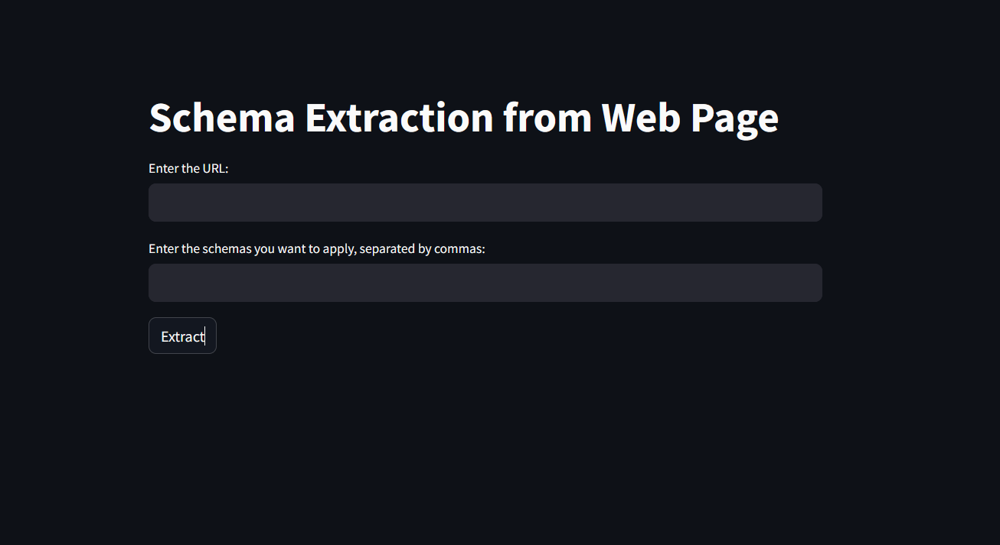
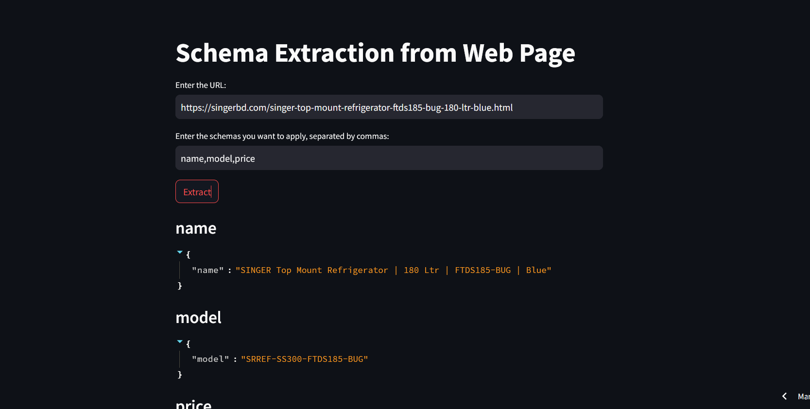

# Web-Scraper-using-LLM
This is a web scraper using LLM where you can provide any URL and provide schemas and the information related to schemas mentioned will be scrapped from the URL provided. With this tool, users can seamlessly extract structured data from any URL by defining custom schemas tailored to their specific requirements. Leveraging LLM integration, the tool ensures precise extraction of relevant information based on the specified schemas. This project signifies a significant advancement in data extraction methodologies, offering a versatile and efficient solution for various applications. Whether it's for market research, competitive analysis, or academic pursuits, our web scraper provides users with a robust means to access and analyze online data effectively.






# Installation
To install Web Scrapper, clone this repository using the following command:
```
git clone https://github.com/Shoaib-33/Web-Scrapper-using-LLM.git
```
Change directory to the downloaded folder
```
cd Web-Scrapper-using-LLM

```
After cloning the repository, create a virtual environment for the program by running the following command:
```
virtualenv venv
```
Activate the virtual environment using the following command (on windows):

```
venv/scripts/activate
```

Finally, install the required dependencies using the following command:
```
pip install -r requirements.txt
```

# Usage

To run the web scraper, activate your virtual environment and navigate to the cloned repository directory. Run the program using the following command: python app.py.It is also deployed in the streamlit and can be accessed using [here](https://web-scrapper-using-llm-eoq5s3dk4hmssicmskrrw3.streamlit.app/).
You can give input of the URL of the link in which you are wanting to scrape and the specific schemas from the link. The format is as:

```
Input
 
URL:https://singerbd.com/singer-top-mount-refrigerator-ftds185-bug-180-ltr-blue.html
Schema: name,model,price

Output

name
{
"name":"SINGER Top Mount Refrigerator | 180 Ltr | FTDS185-BUG | Blue"
}
model
{
"model":"SRREF-SS300-FTDS185-BUG"
}
price
{
"special_price":"৳30,990"
"regular_price":"৳32,990"
}
```

# Model and API
For this experimentation we used the Anthropic Claude Model of which we used the API.The API is provided here as demo but you will have to use your own api for running the app.
